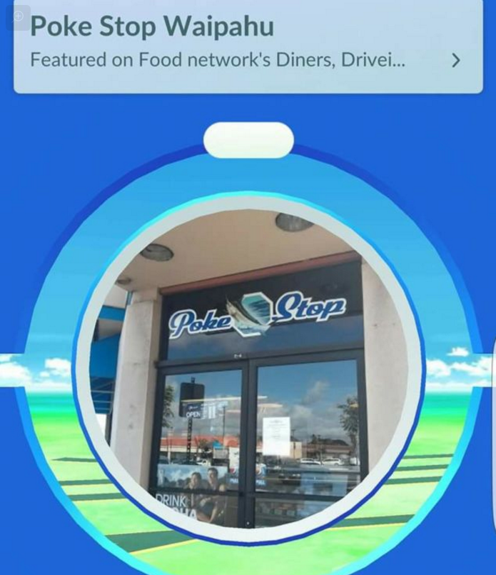
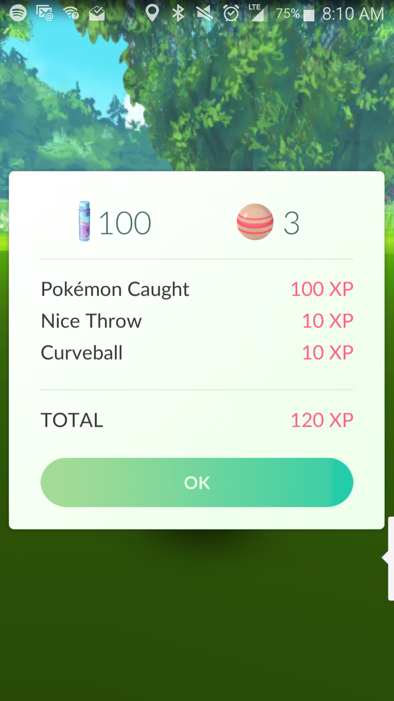
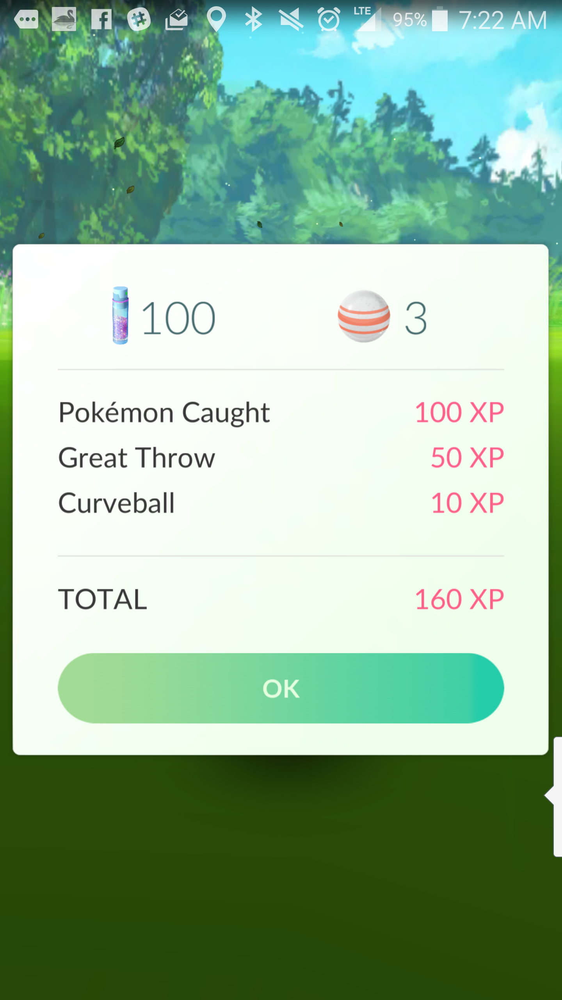
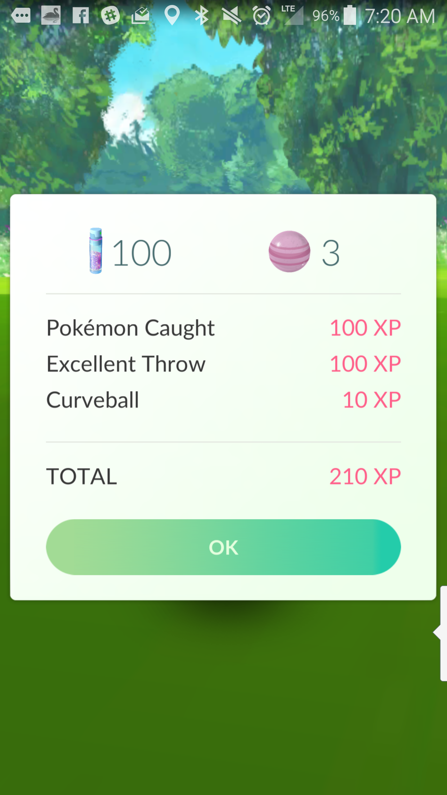

# What Is Pokémon Go
Pokémon Go is a type of game called "Augmented reality," which simply means it takes an aspect of reality and adds something to it. In the case of Pokémon Go, it uses a real map and your actual latitude/longitude and then adds points of interests (called PokéStops and Gyms) as well as Pokémon. If you're unfamiliar with Pokémon as a whole, be sure to read the section [What Are Pokémon](#what_are_pokemon). The game is available on Android and iOS.

# First Time Launch
>NOTE: It is recommended you don't login for your first time in a moving vehicle. As part of the proces you will be choosing your first Pokémon, but they will not follow you if you move.

When you launch the game, you'll be asked to login, either via your Google account or by creating a new Trainer Account. After logging in, you'll be allowed to configure your avatar (what you'll look like in the game) and then be dropped onto a map. This view is called the **Overworld**.

You'll likely see a lot of things pop up around you, but the most important will be three Pokémon: Bulbasaur, Charmander, and Squirtle. You'll be able to tap on one and [Catch it](#catching_pokemon)

After that, you'll have a chance to look around. You'll probably see some [Pokéstops](#pokestops), [Gyms](#gyms), and other [Pokémon to catch](#catching_pokemon). Additionally, you'll see a few icons along the bottom of your screen. 

On the far left is your avatar and level with a level progress bar. Tapping it will bring up your [Profile](#profile). In the middle is the Poké Ball button, which brings up your menu. On the left is the [Pokémon Finder](#finder).

Additionally, at the top of the screen is a compass; this can be tapped to lock in "North" map orientation.

# Profile
Your profile lists a number of stats. From top to bottom:

1. Username
2. Avatar
3. [Team](#team) (Background Image)
4. Total XP
5. Level
6. Progress to next level
7. PokéCoins, Start Date, [Team](#Team) Icon / Name
8. Badge Section[^badges]

[^badges]: You might notice that some of the badges don't match your gender. This is because in the original Pokémon games there were trainer types of these names which Pokémon Go makes a nostalgic nod to. For example, there was a "Fisherman" but no "Fisherwoman", and a "Battle Girl" but no "Battle Boy"

Additionaly, there's a menu button in the lower right that allows you to see your Journal and re-customize your character.

# Pokémon Finder
Stuff about the Pokémon Finder.

# Team
At level 5 you'll be given the choice to choose a Team: Blue, Red, or Yellow.

PUT IN THE DESCRIPTIONS

The choice you make is primarily relevant when you're interacting with [Gyms](#gyms) (and, of course, when meeting new people while playing!).

# What are Pokémon?
Pokémon means several things:

1. A series of games from The Pokémon Company, which is owned by Nintendo, Creatures, and GameFreak. Games include:
  * Main Series (Red, Blue, Yellow, Gold, Silver, Crystal, Ruby, Sapphire, Emerald, Diamond, Pearl, Platinum, HeartGold, SoulSilver, Black, White, Black2, White2, X, Y, AlphaSaphire, OmegaRuby)
  * Mystery Dungeon
  * Ranger
  * Rumble
  * Pinball
  * Pokémon Go
1. Animals featured in the Pokémon series which players catch, train, battle, and interact in other ways.
  * Different games feature different ways of interacting with Pokémon
1. The animated series and movies

In general, when this guide refers to Pokémon, it's to the creatures you see on the screen while playing Pokémon Go

# Pokéstops

Pokéstops, which from a distance look like cubes atop pedestals, represent points of interest in the real world. These could be art fixtures, historic buildings, signs, or other landmarks. When you get close to them, they will expand into concentric circles resembling a Poké Ball.

 
When you are close enough to a Pokéstop for it to transform, you're close enough to interact with it. Simply tap the icon and it will zoom into a detailed look at the location.

Slide your finger across the large circle to spin the Pokéstop and gain [Experience Points](#experience_points) and [items relative to your level](#experience_points).

For a full list of items, see [Items](#items). Note, too, that you don't need to *tap* the items; their appearence on the scren is enough!

You can spin a Pokéstop once every five (5) minutes, and the items that drop appear to be random. Once your inventory is full, you will begin to get a "Bag is full" message instead of items. See [Bag Management](#bag_management) for more information.

# Bag Management
When you start the game, your bag can contain up to 350 [items](#items). You can increase this by buying Bag Upgrades (see [Shop](#shop)). 

## Removing Items
As you play and spin [Pokéstops](#pokestops), your bag will inevitably get full. To remove items, tap the Poké Ball icon at the bottom of the screen while in the **Overworld**, then tap _Items_. Each item has a little garbage can next to it. Tapping this will bring up an interface where you choose the quantity to throw away. When you've entered the desired number, tap "Yes." You've just cleared up space!

# Gyms
Stuff about gyms

# Catching Pokemon
After tapping a Pokémon on the Overworld screen, you'll be taken to the Catching screen.

If you want to take fun pictures of Pokémon interacting with real-world objects, you can toggle the VR setting in the top-right corner of the screen. Otherwise, you'll have an easier time catching Pokémon (and preserving battery life) if you turn off VR.

At the bottom of the screen you'll see a Poké Ball in the middle of the screen and a Bag icon to the right. Once you're at a level where you have Razz Berries or multiple types of Poké Balls, you'll use this button to control the item you're using.

The difficulty of catching a Pokémon is based on a number of factors:

- Pokémon's CP value
- Pokémon's Species
- The type of Poké Ball you're using
- Whether or not you've fed it a Razz Berry

To see the currennt difficulty level, tap and hold on the Poké Ball; the circle pulsating around the Pokémon will change colors to indicate difficulty, where green is easy to shades of orange and red for more difficult catches.

Sometimes you'll be able to lower the difficulty using a different Poké Ball or feeding the Pokémon a Razz Berry, but some Pokémon are just hard to catch!

Once you're set, you have a few options for how to throw your Poké Ball, but they all have essentially the same goal: make the Poké Ball hit the Pokémon as close to the center of the color circle as possible.

## Straight Up
The simplest technique; simply tap the Poké Ball, drag up your screen, and let go. This technique has the advantage of being very fast, but also is prone to Poké Balls veering off unexpectedly.

## Spin Toss
Here, you tap and hold the Poké Ball and make small circles with your finger, essentially applying _spin_ to the ball. When you're ready to throw, slide your finger sideways and up. If you perform the manuever correctly, the ball will curve from the side of your screen back toward the Pokémon.

>Note: if you're spinning clockwise, throw to the left to have the ball slice back in, otherwise throw to the right for a slice!

This technique usually mitigates the "veering" problem, but also requires more time to throw as well as taking time to learn.

## Post-throw
If you hit, the Pokémon will vanish into the Poké Ball and the center will turn red. At this point all you can do is watch as the ball either wiggles and finally goes gray, indicating success, or the Pokémon bursts out. In the case that the Pokémon escapes, you have the option of feeding it another Razz Berry.

If you miss, simply try again. You won't have to feed it another Razz Berry unless you hit.

The Poké Ball is used up no matter what, and after each hit there is a chance that the Pokémon will run away.

# Shop
Item | Qty | Cost | Coins Per Item
--- | --- | --- | ---
Poké Balls | 20 | 100 PokéCoins | 5
Poké Balls | 100 | 460 PokéCoins | 4.6
Poké Balls | 200 | 800 PokéCoins | 4
Incense | 1 | 80 PokéCoins | 80
Incense | 8 | 500 PokéCoins | 62.5
Incense | 25 | 1250 PokéCoins | 50
Lucky Egg | 1 | 80 PokéCoins | 80
Lucky Egg | 8 | 500 PokéCoins | 62.5
Lucky Egg | 25 | 1250 PokéCoins | 50
Lure Module | 1 | 100 PokéCoins | 100
Lure Modules | 8 | 680 PokéCoins | 85
Egg Incubator | 1 | 150 PokéCoins | 150
Bag Upgrade | 1 | 200 PokéCoins | 200
Pokémon Storage Upgrade | 1 | 200 PokéCoins | 200
>http://www.serebii.net/pokemongo/shop.shtml

## Getting PokéCoins
Every 20 hours, you can go into the Shop and tap on the icon in the upper-right. For every Pokémon you have placed at a [Gym](#gym) at the time, you will receive 10 PokéCoins.

Additionally, you can purchase PokéCoins with real currency:

PokéCoin Amount | Japanese Price | US Price | UK Price | Europe Price | % off
--- | --- | --- | --- | --- | ---
100 PokéCoins | 120¥ | $0.99 | £0.79 | €0.99 | 
550 PokéCoins | 600¥ | $4.99 | £3.99 | €4.99 | 8%
1200 PokéCoins | 1200¥ | $9.99 | £7.99 | €9.99 | 16%
2500 PokéCoins | 2400¥ | $19.99 | £14.99 | €19.99 | 21%
5200 PokéCoins | 4800¥ | $39.99 | £29.99 | €39.99 | 24%
14500 PokéCoins | 11800¥ | $99.99 | £79.99 | €99.99 | 31%

# Items

Item | Desc | Min Level | Use Location | Obtain Method
--- | --- | --- | --- | ---
Bag Upgrade | Increases the item capacity by 50. Max capacity: 1,000 | | Shop | Shop
Camera | Allows for you to take pictures of the Pokémon | | Pokémon Capture | From Beginning
Egg | Hatches into a Pokémon | | Overworld | PokéStops
Egg Incubator | Used to hatch Pokémon Eggs. Each one can hatch 3 Eggs total | | Overworld | Shop, Level Up
Great Ball | Used to capture Pokémon. Has a higher chance of capture. | 12 | Pokémon Capture | PokéStops, Level Up
Hyper Potion | Used to heal Pokémon by 200 HP. | 15 | Overworld | PokéStops, Level Up
Incense | Attracts wild Pokémon to you for 30 minutes. When you're standing still, one will spawn every 5 minutes. When you're on the move, one will spawn every minute | | Overworld | Shop, Level Up
Lucky Egg | Doubles experience gained for 30 minutes | | Overworld | Shop, Level Up
Lure Module | Attracts wild Pokémon to a PokéStop for all players for 30 minutes. Averages an appearance once every 5 minutes | | Overworld | Shop, Level Up
Max Potion | Used to completely heal a Pokémon. | 25 | Overworld | PokéStops, Level Up
Max Revive | Restores a fainted Pokémon and provides full health. | 30 | Overworld | PokéStops, Level Up
Poké Ball | Used to capture Pokémon. Has a standard chance of capture. | | Overworld | Shop, PokéStops, Level Up
Pokémon Storage Upgrade | Increases the Pokémon storage capacity by 50. Max capacity: 1,000 | | Shop | Shop
Potion | Used to heal Pokémon by 20 HP. | 5 | Overworld | PokéStops, Level Up
Razz Berry | Makes it so the next Ball has a higher rate of capture. | 8 | Pokémon Capture | PokéStops, Level Up
Revive | Restores a fainted Pokémon and provides half health. | 5 | Overworld | PokéStops, Level Up
Stardust | Used to Power Up Pokémon. | 10 | Pokémon Selection | Pokémon capture
Super Potion | Used to heal Pokémon by 50 HP. | 10 | Overworld | PokéStops, Level Up
Ultra Ball | Used to capture Pokémon. Has a higher chance of capture. | 20 | Pokémon Capture | PokéStops, Level Up
> http://www.serebii.net/pokemongo/items.shtml

# Experience Points
As opposed to how most Pokémon games work, which is that individual Pokémon gain experience points (XP) and level up, Pokémon Go has you, the player, level up. As you gain XP, the ammount you'll need for the next level increases.

LEVEL | Additional XP | Total XP | Receive | PokéStop Additions
--- | --- | --- | --- | ---
1 | 0 | 0 | | PokeBalls, Eggs[^eggDrop]
2 | 1,000 | 1,000 | 15 Poké Balls
3 | 2,000 | 3,000 | 15 Poké Balls
4 | 3,000 | 6,000 | 15 Poké Balls
5 | 4,000 | 10,000 | 10 Potions, 1 Incense, 10 Revives | Choosing a team, gyms, Great Potions, Revives
6 | 5,000 | 15,000 | 15 Poké Balls, 10 Potions, 10 Revives, 1 Egg Incubator
7 | 6,000 | 21,000 | 15 Poké Balls, 10 Potions, 10 Revives, 1 Incense
8 | 7,000 | 28,000 | 15 Poké Balls, 10 Potions, 5 Revives, 10 Razz Berries, 1 Lure Module | Razz Berries
9 | 8,000 | 36,000 | 15 Poké Balls, 10 Potions, 5 Revives, 3 Razz Berries, 1 Lucky Egg
10 | 9,000 | 45,000 | 15 Poké Balls, 10 Super Potions, 10 Revives, 10 Razz Berries, 1 Incense, 1 Lucky Egg, 1 Egg Incubator, 1 Lure Module | Super Potions
11 | 10,000 | 55,000 | 15 Poké Balls, 10 Super Potions, 3 Revives, 3 Razz Berries
12 | 10,000 | 65,000 | 20 Great Balls, 10 Super Potions, 3 Revives, 3 Razz Berries | Great Balls
13 | 10,000 | 75,000 | 15 Great Balls, 10 Super Potions, 3 Revives, 3 Razz Berries
14 | 10,000 | 85,000 | 15 Great Balls, 10 Super Potions, 3 Revives, 3 Razz Berries
15 | 15,000 | 100,000 | 15 Great Balls, 20 Hyper Potions, 10 Revives, 10 Razz Berries, 1 Incense, 1 Lucky Egg, 1 Egg Incubator, 1 Lure Module | Hyper Potions
16 | 20,000 | 120,000 | 10 Great Balls, 10 Hyper Potions, 5 Revives, 5 Razz Berries
17 | 20,000 | 140,000 | 10 Great Balls, 10 Hyper Potions, 5 Revives, 5 Razz Berries
18 | 20,000 | 160,000 | 10 Great Balls, 10 Hyper Potions, 5 Revives, 5 Razz Berries
19 | 25,000 | 185,000 | 10 Great Balls, 10 Hyper Potions, 5 Revives, 5 Razz Berries
20 | 25,000 | 210,000 | 20 Ultra Balls, 20 Hyper Potions, 20 Revives, 20 Razz Berry, 2 Incense, 2 Lucky Eggs, 2 Egg Incubators, 2 Lure Modules | Ultra Balls
21 | 50,000 | 260,000 | 10 Ultra Balls, 10 Hyper Potions, 10 Revives, 10 Razz Berries
22 | 75,000 | 335,000 | 10 Ultra Balls, 10 Hyper Potions, 10 Revives, 10 Razz Berries
23 | 100,000 | 435,000 | 10 Ultra Balls, 10 Hyper Potions, 10 Revives, 10 Razz Berries
24 | 125,000 | 560,000 | 10 Ultra Balls, 10 Hyper Potions, 10 Revives, 10 Razz Berries
25 | 150,000 | 710,000 | 25 Ultra Balls, 20 Max Potions, 15 Revives, 15 Razz Berries, 1 Incense, 1 Lucky Egg, 1 Egg Incubator, 1 Lure Module | Max Potions
26 | 190,000 | 900,000 | 10 Ultra Balls, 15 Max Potions, 10 Revives, 15 Razz Berries
27 | 200,000 | 1,100,000 | 10 Ultra Balls, 15 Max Potions, 10 Revives, 15 Razz Berries
28 | 250,000 | 1,350,000 | 10 Ultra Balls, 15 Max Potions, 10 Revives, 15 Razz Berries
29 | 300,000 | 1,650,000 | 10 Ultra Balls, 15 Max Potions, 10 Revives, 15 Razz Berries
30 | 350,000 | 2,000,000 | 30 Ultra Balls, 20 Max Potions, 20 Max Revives, 20 Razz Berries, 3 Incense, 3 Lucky Eggs, 3 Egg Incubators, 3 Lure Modules | Max Revive
31 | 500,000 | 2,500,000 | 10 Ultra Balls, 15 Max Potions, 10 Max Revives, 15 Razz Berries
32 | 500,000 | 3,000,000 | 10 Ultra Balls, 15 Max Potions, 10 Max Revives, 15 Razz Berries
33 | 750,000 | 3,750,000 | 10 Ultra Balls, 15 Max Potions, 10 Max Revives, 15 Razz Berries
34 | 1,000,000 | 4,750,000 | 10 Ultra Balls, 15 Max Potions, 10 Max Revives, 15 Razz Berries
35 | 1,250,000 | 6,000,000 | 30 Ultra Bells, 20 Max Potions, 20 Max Revives, 20 Razz Berries, 2 Incense, 1 Lucky Egg, 1 Lure Module
36 | 1,500,000 | 7,500,000 | 30 Ultra Balls, 20 Max Potions, 10 Max Revives, 20 Razz Berries
37 | 2,000,000 | 9,500,000 | 20 Ultra Balls, 20 Max Potions, 10 Max Revives, 20 Razz Berries
38 | 2,500,000 | 12,000,000 | 20 Ultra Balls, 20 Max Potions, 10 Max Revives, 20 Razz Berries
39 | 3,000,000 | 15,000,000 | 20 Ultra Balls, 20 Max Potions, 10 Max Revives, 20 Razz Berries
40 | 5,000,000 | 20,000,000 | 40 Ultra Balls, 40 Max Potions, 40 Max Revives, 40 Razz Berries, 4 Incense, 4 Lucky Eggs, 4 Egg Incubators, 4 Lure Modules
>http://www.polygon.com/2016/7/19/12227650/pokemon-go-level-rewards

[^eggDrop]: Eggs will stop appearing at Pokéstops once you have 9. When you hatch one, they'll begin to appear again.
Data from http://www.serebii.net/pokemongo/items.shtml

The situation is complicated by the fact that the things that provide you with XP do not scale with you.

Activity | XP Value
--- | ---
"Spinning" [PokéStops](#pokestops) | 50, or 100 if 6+ items
Catching a Pokémon | 100 - 210*
Acquiring a New Pokémon | 500
Hatching an Egg | Unconfirmed[^eggXP]
Fighting an opponent's [Gym](#gym) | up to 100
Winning a fight against opponent's [Gym](#gym) | up to 150
Winning at a friendly [Gym](#gym) | up to 100

There are 4 "Catching" modifiers, one of which stacks with the others.

Modifier | Value | Stacks
--- | --- | ---
Curve Ball | 10 | Yes
Nice Throw | 10 | No
Great Throw | 50 | No
Excellent Throw | 100 | No

 

[^eggXP]: Some sources state a flat value of 500xp, others suggest 100xp per KM needed to hatch the egg.

## Leveling Techniques
One of the most important items when trying to level is the Lucky Egg. This is a 1-time use item that lasts for 30 minutes. While the effect is active all XP you earn is doubled. All of the techinques that follow can be enhanced by optimizing this time.

### Evolution Blitz
>Max Potential: 30,000 (60,000 with Lucky Egg)[^evolutionNote]

 One way of doing this is to save Pokémon and candy until you have enough to spend the full 30 minutes evolving and transferring Pokémon. Because of their low evolution cost and high encounter rate, the best candidates for this are Caterpie, Weedle, and Pidgey.

All three of the above Pokémon cost 12 candy to evolve, but since we're not aiming to keep them, you can transfer them to take their evolution cost down to 11 for all but the first. It takes roughly 30 seconds to evolve and transfer each Pokémon, so you should queue up around 60 Pokémon, which means if you're working with all of one type, you'll need:

>12 + ( 11 * 59 ) = 661 candies

To get these, you'll need to catch 60 Pokémon and keep them (so they'll be worth 3 candy), and then catch more and transfer them (so they'll be worth 4)

>(x * 4) + (60 * 3) = 661
>
>(x * 4) + 180 = 661
>
>(x * 4) = 481
>
>x = ~121

Adding the 121 back to the 60 we need, that's 181 Pokémon. That's a lot, but bear in mind you don't NEED a full batch to make this process worth it... but if you do, that's 2 * (60 * 500xp), or 60,000xp. Not bad for 30 minutes.

[^evolutionNote]: You don't have to stick to just these three Pokémon. If you save candy from all of your Pokémon, you could get even more for new Pokémon!

### The Marathon

More in the spirit of Pokémon Go's goal of getting you up and moving is finding a location where you can constantly spin Pokéstops. It takes less than 5 seconds to zoom in, spin, and zoom back out, so, in theory, you could interact with 360 Pokéstops. Each Pokéstop could be worth 50XP or 100XP, depending on how many items you get; lets assume an average of 55 (1 in 10 giving 100XP).

>55 * 360 = 19,800

Let's call it an even 20,000, and this is just from the Pokéstops; you'll also be able to hatch eggs rapidly with this approach. Just watch your inventory level!