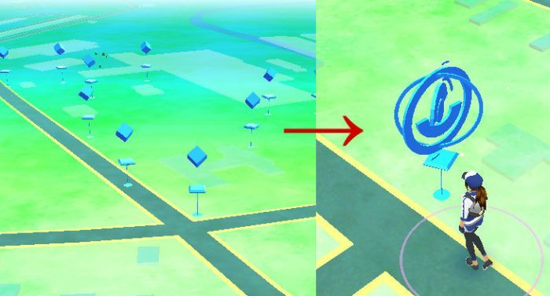

# What Is Pokémon Go
Pokémon Go is a type of game called "Augmented reality," which simply means it takes an aspect of reality and adds something to it. In the case of Pokémon Go, it uses a real map and your actual latitude/longitude and then adds points of interests (called PokéStops and Gyms) as well as Pokémon. If you're unfamiliar with Pokémon as a whole, be sure to read the section [What Are Pokémon](#what_are_pokemon). The game is available on Android and iOS.

# First Time Launch
>NOTE: It is recommended you don't login for your first time in a moving vehicle. As part of the proces you will be choosing your first Pokémon, but they will not follow you if you move.

When you launch the game, you'll be asked to login, either via your Google account or by creating a new Trainer Account. After logging in, you'll be allowed to configure your avatar (what you'll look like in the game) and then be dropped onto a map. You'll likely see a lot of things pop up around you, but the most important will be three Pokémon: Bulbasaur, Charmander, and Squirtle. You'll be able to tap on one and [Catch it](#catching_pokemon)

After that, you'll have a chance to look around. You'll probably see some [Pokéstops](#what_is_a_pokestop), [Gyms](#gyms), and other [Pokémon to catch](#catching_pokemon).

# What are Pokémon?
Pokémon means several things:

1. A series of games from The Pokémon Company, which is owned by Nintendo, Creatures, and GameFreak. Games include:
  * Main Series (Red, Blue, Yellow, Gold, Silver, Crystal, Ruby, Sapphire, Emerald, Diamond, Pearl, Platinum, HeartGold, SoulSilver, Black, White, Black2, White2, X, Y, AlphaSaphire, OmegaRuby)
  * Mystery Dungeon
  * Ranger
  * Rumble
  * Pinball
  * Pokémon Go
1. Animals featured in the Pokémon series which players catch, train, battle, and interact in other ways.
  * Different games feature different ways of interacting with Pokémon
1. The animated series and movies

In general, when this guide refers to Pokémon, it's to the creatures you see on the screen while playing Pokémon Go

# Pokéstops

Pokéstops, which from a distance look like cubes atop pedestals, represent points of interest in the real world. These could be art fixtures, historic buildings, signs, or other landmarks. When you get close to them, they will expand into concentric circles resembling a Pokéball.

 
When you are close enough to a Pokéstop for it to transform, you're close enough to interact with it. Simply tap the icon and it will zoom into a detailed look at the location.

Slide your finger across the large circle to spin the Pokéstop and gain 50 [Experience Points](#experience_points) and items relative to your level:

Item | Required Level | Description
--- | --- | ---
Pokéball | 1 | Used to capture Pokémon. Has a standard chance of capture.
Egg* | 1 | Hatches into a Pokémon
Potion | 5 | Used to heal Pokémon by 20 HP.
Revive | 5 | Restores a fainted Pokémon and provides half health.
Razz Berry | 8 | Makes it so the next Ball has a higher rate of capture.
Super Potion | 10 | Used to heal Pokémon by 50 HP.
Great Ball | 12 | Used to capture Pokémon. Has a higher chance of capture.
Hyper Potion | 15 | Used to heal Pokémon by 200 HP.
Ultra Ball | 20 | Used to heal Pokémon by 200 HP.
Max Potion | 25 | Used to completely heal a Pokémon.
Max Revive | 30 | Restores a fainted Pokémon and provides full health.

> *Eggs will stop appearing at Pokéstops once you have 9. When you hatch one, they'll begin to appear again.
Data from http://www.serebii.net/pokemongo/items.shtml

For a full list of items, see [Items](#items)

##Using Pokéstops

# Gyms
Stuff about gyms

# Catching Pokemon
Stuff about catching

# Items
Stuff about items

# Experience Points
As opposed to how most Pokémon games work, which is that individual Pokémon gain experience points (XP) and level up, Pokémon Go has you, the player, level up. As you gain XP, the ammount you'll need for the next level increases. For more information about what you can do at each level, see [Levels](#levels)

LEVEL | XP Needed To Reach Level | Total XP | Receive | Unlocks
--- | --- | --- | --- | ---
1 | 0 | 0 |
2 | 1,000 | 1,000 | 15 PokéBalls
3 | 2,000 | 3,000 | 15 PokéBalls
4 | 3,000 | 6,000 | 15 PokéBalls
5 | 4,000 | 10,000 | 10 Potions, 1 Incense, 10 Revives | Choosing a team, gyms, Great Potions, Revives
6 | 5,000 | 15,000 | 15 Poké Balls, 10 Potions, 10 Revives, 1 Egg Incubator
7 | 6,000 | 21,000 | 15 Poké Balls, 10 Potions, 10 Revives, 1 Incense
8 | 7,000 | 28,000 | 15 Poké Balls, 10 Potions, 5 Revives, 10 Razz Berries, 1 Lure Module | Razz Berries
9 | 8,000 | 36,000 | 15 Poké Balls, 10 Potions, 5 Revives, 3 Razz Berries, 1 Lucky Egg
10 | 9,000 | 45,000 | 15 Poké Balls, 10 Super Potions, 10 Revives, 10 Razz Berries, 1 Incense, 1 Lucky Egg, 1 Egg Incubator, 1 Lure Module | Super Potions
11 | 10,000 | 55,000 | 15 Poké Balls, 10 Super Potions, 3 Revives, 3 Razz Berries
12 | 10,000 | 65,000 | 20 Great Balls, 10 Super Potions, 3 Revives, 3 Razz Berries | Great Balls
13 | 10,000 | 75,000 | 15 Great Balls, 10 Super Potions, 3 Revives, 3 Razz Berries
14 | 10,000 | 85,000 | 15 Great Balls, 10 Super Potions, 3 Revives, 3 Razz Berries
15 | 15,000 | 100,000 | 15 Great Balls, 20 Hyper Potions, 10 Revives, 10 Razz Berries, 1 Incense, 1 Lucky Egg, 1 Egg Incubator, 1 Lure Module | Hyper Potions
16 | 20,000 | 120,000 | 10 Great Balls, 10 Hyper Potions, 5 Revives, 5 Razz Berries
17 | 20,000 | 140,000 | 10 Great Balls, 10 Hyper Potions, 5 Revives, 5 Razz Berries
18 | 20,000 | 160,000 | 10 Great Balls, 10 Hyper Potions, 5 Revives, 5 Razz Berries
19 | 25,000 | 185,000 | 10 Great Balls, 10 Hyper Potions, 5 Revives, 5 Razz Berries
20 | 25,000 | 210,000 | 20 Ultra Balls, 20 Hyper Potions, 20 Revives, 20 Razz Berry, 2 Incense, 2 Lucky Eggs, 2 Egg Incubators, 2 Lure Modules | Ultra Balls
21 | 50,000 | 260,000 | 10 Ultra Balls, 10 Hyper Potions, 10 Revives, 10 Razz Berries
22 | 75,000 | 335,000 | 10 Ultra Balls, 10 Hyper Potions, 10 Revives, 10 Razz Berries
23 | 100,000 | 435,000 | 10 Ultra Balls, 10 Hyper Potions, 10 Revives, 10 Razz Berries
24 | 125,000 | 560,000 | 10 Ultra Balls, 10 Hyper Potions, 10 Revives, 10 Razz Berries
25 | 150,000 | 710,000 | 25 Ultra Balls, 20 Max Potions, 15 Revives, 15 Razz Berries, 1 Incense, 1 Lucky Egg, 1 Egg Incubator, 1 Lure Module | Max Potions
26 | 190,000 | 900,000 | 10 Ultra Balls, 15 Max Potions, 10 Revives, 15 Razz Berries
27 | 200,000 | 1,100,000 | 10 Ultra Balls, 15 Max Potions, 10 Revives, 15 Razz Berries
28 | 250,000 | 1,350,000 | 10 Ultra Balls, 15 Max Potions, 10 Revives, 15 Razz Berries
29 | 300,000 | 1,650,000 | 10 Ultra Balls, 15 Max Potions, 10 Revives, 15 Razz Berries
30 | 350,000 | 2,000,000 | 30 Ultra Balls, 20 Max Potions, 20 Max Revives, 20 Razz Berries, 3 Incense, 3 Lucky Eggs, 3 Egg Incubators, 3 Lure Modules | Max Revive
31 | 500,000 | 2,500,000 | 10 Ultra Balls, 15 Max Potions, 10 Max Revives, 15 Razz Berries
32 | 500,000 | 3,000,000 | 10 Ultra Balls, 15 Max Potions, 10 Max Revives, 15 Razz Berries
33 | 750,000 | 3,750,000 | 10 Ultra Balls, 15 Max Potions, 10 Max Revives, 15 Razz Berries
34 | 1,000,000 | 4,750,000 | 10 Ultra Balls, 15 Max Potions, 10 Max Revives, 15 Razz Berries
35 | 1,250,000 | 6,000,000 | 30 Ultra Bells, 20 Max Potions, 20 Max Revives, 20 Razz Berries, 2 Incense, 1 Lucky Egg, 1 Lure Module
36 | 1,500,000 | 7,500,000 | 30 Ultra Balls, 20 Max Potions, 10 Max Revives, 20 Razz Berries
37 | 2,000,000 | 9,500,000 | 20 Ultra Balls, 20 Max Potions, 10 Max Revives, 20 Razz Berries
38 | 2,500,000 | 12,000,000 | 20 Ultra Balls, 20 Max Potions, 10 Max Revives, 20 Razz Berries
39 | 3,000,000 | 15,000,000 | 20 Ultra Balls, 20 Max Potions, 10 Max Revives, 20 Razz Berries
40 | 5,000,000 | 20,000,000 | 40 Ultra Balls, 40 Max Potions, 40 Max Revives, 40 Razz Berries, 4 Incense, 4 Lucky Eggs, 4 Egg Incubators, 4 Lure Modules
Source: http://www.polygon.com/2016/7/19/12227650/pokemon-go-level-rewards

The situation is complicated by the fact that the things that provide you with XP do not scale with you.

Activity | XP Value
--- | ---
"Spinning" [PokéStops](#what_is_a_pokestop) | 50, or 100 if 6+ items
Catching a Pokémon | 100 - 200 
Acquiring a New Pokémon | 500
Hatching an Egg | Unconfirmed[^eggXP]
Fighting an opponent's [Gym](#what_is_a_gym) | up to 100
Winning a fight against opponent's [Gym](#what_is_a_gym) | up to 150
Winning at a friendly [Gym](#what_is_a_gym) | up to 100

>Note: There are 4 "Catching" modifiers which do not stack:
>
>Modifier | Value
>--- | ---
>Nice Throw | 10
>Great Throw | 50
>Excellent Throw | 100
>Curve Ball | 10

[^eggXP]: Some sources state a flat value of 500xp, others suggest 100xp per KM needed to hatch the egg.

#  Levels
In Pokémon Go, the player gains levels instead of, as is traditionally the case, their Pokémon. As you progress you unlock 